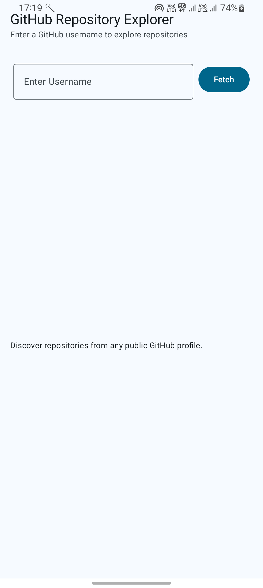
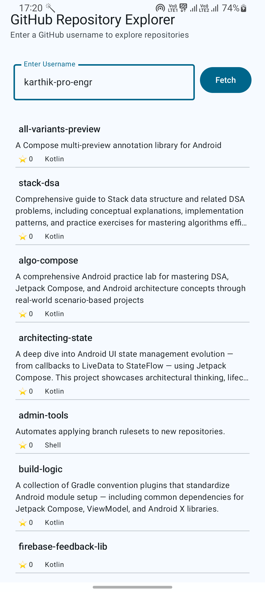
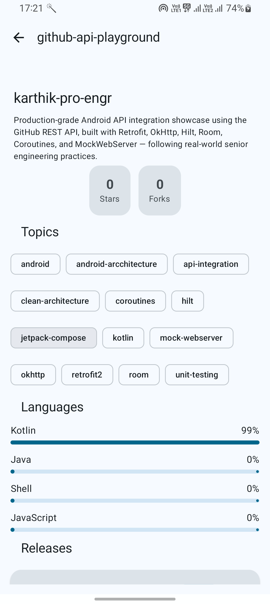
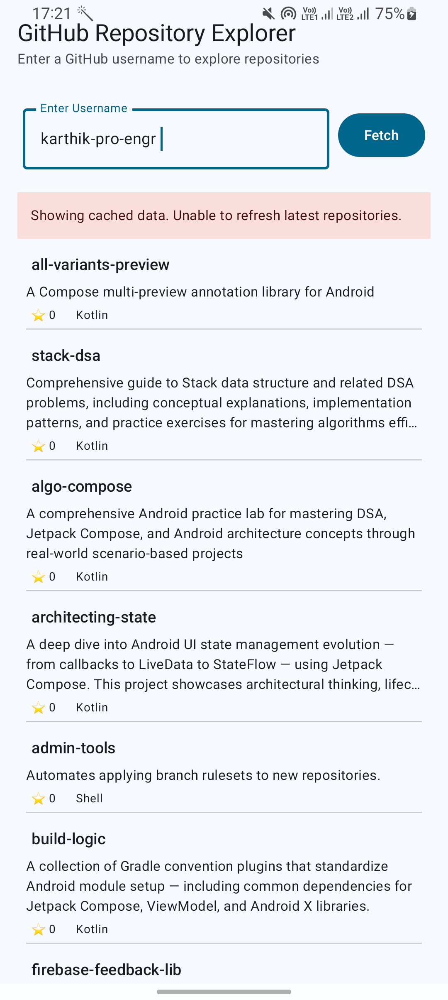
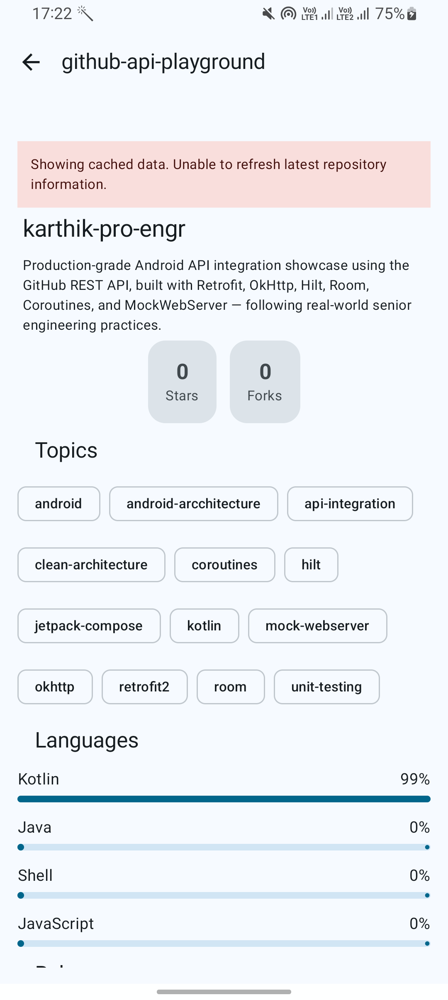
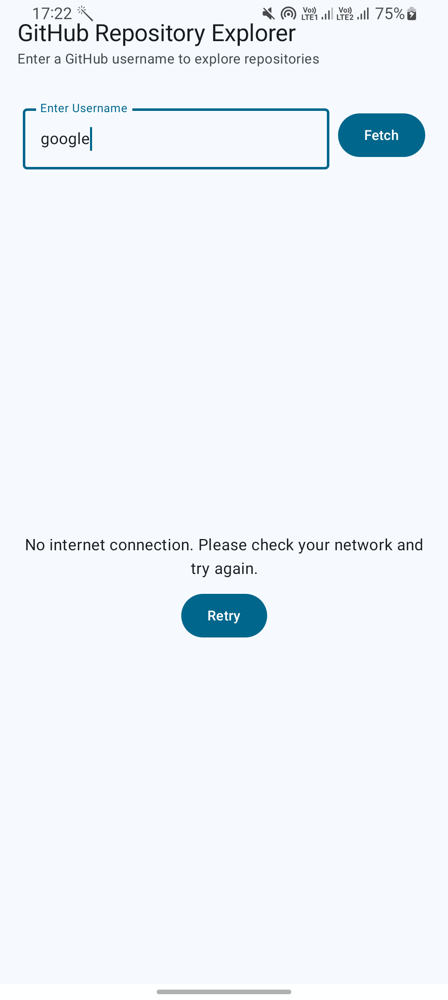

# Android Engineering Playground 🚀

A production-oriented Android portfolio project showcasing
Offline-First Architecture, Clean Architecture, Paging 3,
WorkManager, Jetpack Compose, CI/CD, and modern Android
engineering practices.

---

# ✨ Key Highlights

✅ Offline-First Architecture

✅ Room as Single Source of Truth (SSOT)

✅ Paging 3 + RemoteMediator

✅ WorkManager Background Synchronization

✅ Clean Architecture + MVVM

✅ Hilt Dependency Injection

✅ Pull-To-Refresh Support

✅ Firebase Crashlytics

✅ Firebase App Distribution

✅ Automated Testing

✅ GitHub Actions CI

---

# 📱 Screenshots

## Home Screen

Search public GitHub repositories by username.

---

## Repository Search Results

Paginated repository list powered by Paging 3 and Room.

---

## Repository Details

Detailed repository information including topics, language distribution, stars, forks, and releases.

---

## Offline Cached Repository List

Previously loaded repositories remain available when network connectivity is unavailable.

---

## Offline Cached Repository Details

Repository details continue to work from local storage even when offline.

---

## Offline Empty State

Graceful error handling when no cached data exists and network is unavailable.

---

# 🏗️ Architecture

Detailed architecture documentation:

[Architecture Documentation](docs/architecture.md)

---

# ⚙️ Architecture Overview

The project follows Clean Architecture principles with clear separation between Presentation, Domain, and Data layers.

The application adopts an Offline-First approach where Room acts as the Single Source of Truth (SSOT).

Data Flow:

GitHub API

→ Retrofit

→ RemoteMediator

→ Room Database (SSOT)

→ PagingSource

→ Repository

→ Use Cases

→ ViewModel

→ Jetpack Compose UI

The UI never reads directly from the network. All data consumed by the UI originates from Room.

---

# 🔧 Engineering Challenges & Solutions

This project evolved from a simple network-based implementation into a production-oriented Offline-First architecture.

Key engineering decisions include:

* Migrating from direct API pagination to RemoteMediator
* Implementing Room as SSOT
* Introducing resilient offline support
* Background synchronization with WorkManager
* Centralized error handling
* Scalable repository architecture

Detailed write-up:

[Engineering Challenges & Solutions](docs/engineering-challenges.md)

---

# 🔄 CI/CD

This project uses GitHub Actions to automate quality checks and release delivery.

### Continuous Integration

Every Pull Request and push triggers:

* Build Validation (`assembleDebug`)
* Unit Tests
* Android Lint
* Artifact Generation

### Continuous Delivery

Version tags automatically trigger:

* Signed Beta APK Generation
* Firebase App Distribution
* Release Artifact Upload

### Pipeline Highlights

* Automated Build Verification
* Automated Testing
* Static Code Analysis
* Secure Signing with GitHub Secrets
* Firebase App Distribution
* Artifact Archiving

Detailed documentation:

[CI/CD Documentation](docs/ci-cd.md)

---

# 🧪 Testing

The project includes automated testing for critical application layers.

### Covered Areas

* ViewModels
* Use Cases
* Repository Layer
* Paging Components
* Data Mapping Logic
* Error Handling Logic

### Testing Stack

* JUnit
* MockK
* Coroutines Test
* Turbine
* MockWebServer

The goal is to ensure business logic remains reliable, maintainable, and independently testable.

---

# 🛠️ Tech Stack

| Category             | Technology                           |
| -------------------- | ------------------------------------ |
| Language             | Kotlin                               |
| UI                   | Jetpack Compose, Material 3          |
| Architecture         | Clean Architecture, MVVM             |
| Dependency Injection | Hilt                                 |
| Networking           | Retrofit, OkHttp                     |
| Database             | Room                                 |
| Pagination           | Paging 3, RemoteMediator             |
| Background Sync      | WorkManager                          |
| Concurrency          | Coroutines, Flow                     |
| Testing              | JUnit, MockK, Turbine, MockWebServer |
| Monitoring           | Firebase Crashlytics                 |
| Distribution         | Firebase App Distribution            |
| CI/CD                | GitHub Actions                       |
| Build System         | Gradle Kotlin DSL                    |

---

# 👨‍💻 Author

## Karthik

Senior Android Engineer | 10+ Years Experience

Passionate about building scalable, resilient, and production-ready Android applications using modern Android development practices.

### Connect

* GitHub: https://github.com/karthik-pro-engr
* LinkedIn: https://www.linkedin.com/in/karthikkumar-thangavel-a2a5b5229/

---

# 🚀 Future Improvements

* GraphQL Integration
* Advanced Synchronization Policies
* Multi-Account Support
* Feature Module Expansion
* Enhanced CI/CD Pipeline

---

# 📄 License

Licensed under the Apache License 2.0.

See the [LICENSE](LICENSE) file for details.
