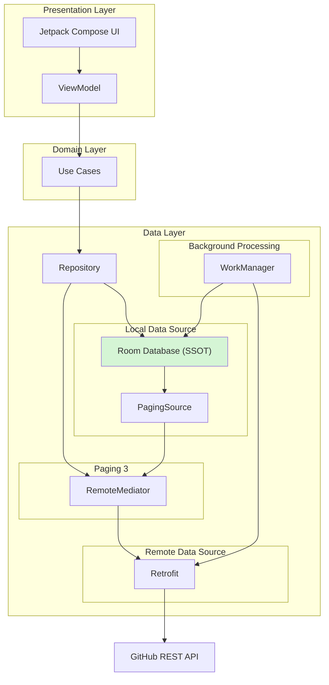

# Architecture

## Overview

The project follows Clean Architecture principles with clear separation between Presentation, Domain, and Data layers.

The application adopts an Offline-First approach where Room acts as the Single Source of Truth (SSOT).

---

## Layers

### Presentation Layer

- Jetpack Compose
- ViewModel

Responsibilities:

- UI rendering
- State management
- User interaction handling

---

### Domain Layer

- Use Cases

Responsibilities:

- Business logic
- Application rules

---

### Data Layer

- Repository
- Room
- Retrofit
- RemoteMediator

Responsibilities:

- Data synchronization
- Caching
- Pagination

---

## Offline First Data Flow

GitHub API
→ RemoteMediator
→ Room Database (SSOT)
→ PagingSource
→ Repository
→ UseCase
→ ViewModel
→ Compose UI

---

## Background Sync

WorkManager is responsible for:

- Periodic synchronization
- Retry handling
- Exponential backoff
- Network constraints

---

## Why Room as SSOT?

Benefits:

- Offline support
- Testability
- Predictable state
- Consistent UI data source